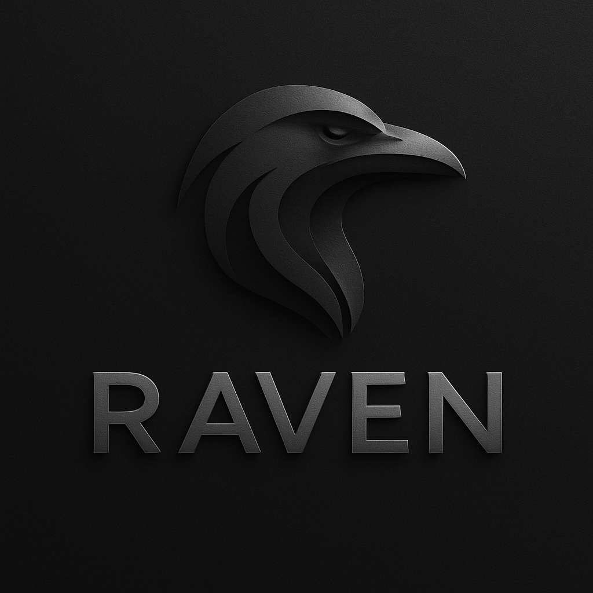

# RAVEN


*A hypothesis-validation copilot that turns an equity thesis into a sourced, downloadable investment memo.*

[](#license)
[](#requirements)
[](#current-status)

## Overview
RAVEN accepts a natural-language investment hypothesis (e.g. "AAPL services revenue will keep outgrowing hardware over the next year") and runs it through a staged research pipeline: it plans what data to pull, fetches fundamentals and market data from Yahoo Finance, has an LLM write and execute Python analysis code against that data, synthesizes a narrative, and renders a PDF investment memo with an evidence trail. It's aimed at equity/investment analysts who want to compress the first pass of hypothesis diligence — normally spread across data pulls, spreadsheets, and write-ups — into a single guided session with an optional human-review checkpoint before the report is finalized. The backend is a FastAPI service; each hypothesis submission runs as an in-process async pipeline (not a distributed workflow engine — see "How It Works" below) whose intermediate artifacts (plans, raw data, metrics, charts, PDFs) are persisted to disk for auditability.

## Key Features
- **Structured planning stage** — an LLM turns the hypothesis into a concrete list of Yahoo Finance tool calls and analysis steps (`orchestration/langgraph_pipeline.py::_run_plan_generation`).
- **Yahoo Finance data layer** — 12 typed tools (company info, historical prices, financials, balance sheet, cash flow, earnings, recommendations, news, holders, dividends, splits, options) wrapping `yfinance` (`orchestration/yfinance_tools.py`, `orchestration/tool_catalog.py`).
- **LLM-written analysis code executed in-process** — the model generates Python that is run in `PythonSandbox` (`orchestration/python_sandbox.py`) against the fetched data, with retry-on-failure up to `MAX_REPL_ATTEMPTS` and a `RESULT::` JSON contract for extracting output.
- **Automatic chart generation** — matplotlib figures produced during analysis (or a fallback chart if none are generated) are embedded into the final report.
- **PDF report rendering** — a ReportLab-generated investment memo (executive summary, key findings, risks, next steps) with every input artifact traceable via `EvidenceReference` URIs.
- **Optional human-in-the-loop review** — hypotheses can be flagged `requires_human_review`, which pauses the pipeline before delivery until an analyst approves, rejects, or requests changes via `/resume`.
- **FastAPI + lightweight web UI** — submit, poll status, cancel, resume, and download reports from a single-page UI (`api/templates/landing.html`) or the REST API directly.
- **Prometheus metrics** — HTTP, LLM call latency/token usage, and per-stage latency counters exposed at `/metrics` (`metrics.py`).

## How It Works
The pipeline is a sequential, six-stage state machine driven by `HypothesisWorkflowClient` (`workflows/hypothesis_workflow.py`), which runs each stage as an `asyncio` task and calls straight into `LangGraphValidationOrchestrator` (`orchestration/langgraph_pipeline.py`). Despite the class name and the `langgraph` dependency in `pyproject.toml`, the current implementation does **not** build a LangGraph `StateGraph` — it's a plain `if/elif` stage dispatcher; "LangGraph" appears to be a naming holdover from an earlier iteration. Likewise, git history shows a prior Temporal-based workflow engine (`workflows/definitions.py`, `workflows/activities/`) — that code is still present but dead on the live path: `main.py` only ever constructs the local `HypothesisWorkflowClient` (its `namespace`/`task_queue`/`address` fields are vestigial and unused), and `HypothesisValidationWorkflow` now just raises if instantiated. The activity wrappers in `workflows/activities/validation.py` are exercised only by `tests/test_workflow_activities.py`, not by the running application.

```
1. plan_generation    — LLM proposes data-fetch tools + analysis steps       -> validation_plan.json
2. data_collection    — YFinanceToolSet executes each planned tool call      -> data_XX_<tool>.json
3. hybrid_analysis    — LLM writes Python; PythonSandbox executes it,        -> analysis_metrics.json
                         retrying up to 5x on failure; charts saved as PNGs
4. detailed_analysis  — LLM narrates the metrics into prose
5. report_generation  — LLM drafts executive summary/findings/risks;         -> report PDF
                         ReportLab renders the PDF
   [optional]         — pipeline pauses here if requires_human_review=True
6. delivery           — marks the report as available for download
```
All artifacts are written under `ARTIFACT_STORE_PATH` (default `./data/artifacts`) via `storage/artifact_store.py`, and each stage records `EvidenceReference`s so the final `ValidationSummary` can point back to the exact JSON/PDF/chart that backs a claim.

## Project Structure
```
raven/
├── src/hypothesis_agent/
│   ├── main.py                       # FastAPI app factory / entrypoint
│   ├── config.py                     # pydantic-settings environment config
│   ├── llm.py                        # OpenAI-backed planner/report/code-gen LLM adapter
│   ├── metrics.py                    # Prometheus counters/histograms
│   ├── api/
│   │   ├── router.py                 # /v1/hypotheses REST endpoints
│   │   ├── ui.py                     # landing page route
│   │   └── templates/landing.html    # single-page submit/monitor/download UI
│   ├── orchestration/
│   │   ├── langgraph_pipeline.py     # stage dispatcher + LLM-REPL analysis loop
│   │   ├── python_sandbox.py         # exec()-based code runner for LLM-generated analysis
│   │   ├── tool_catalog.py           # YFinance tool metadata
│   │   └── yfinance_tools.py         # yfinance API wrappers
│   ├── workflows/
│   │   ├── hypothesis_workflow.py    # live local async pipeline runner
│   │   ├── definitions.py            # legacy Temporal-era stub (unused)
│   │   └── activities/validation.py  # legacy Temporal-era activities (test-only)
│   ├── services/hypothesis_service.py  # submission/status/resume/cancel orchestration
│   ├── repositories/hypothesis_repository.py  # in-memory hypothesis store
│   ├── storage/artifact_store.py     # filesystem-backed artifact persistence
│   └── models/hypothesis.py          # pydantic request/response/domain models
├── tests/                            # pytest suite (config, repo, service, workflow, API, UI)
├── scripts/test_repl.py              # standalone REPL harness for the analysis loop
├── assets/logo.png
├── .env.example
└── pyproject.toml
```

## Getting Started

### Requirements
- Python 3.10+ (developed/tested on 3.12)
- An OpenAI API key (the pipeline raises at startup without one — there is currently no offline/mock mode for running the real app)

### Installation
```bash
git clone https://github.com/ayushsi42/raven.git
cd raven
python -m venv .venv && source .venv/bin/activate
pip install -e .
cp .env.example .env   # then fill in OPENAI_API_KEY
```

### Usage
Run the API + UI:
```bash
PYTHONPATH=src uvicorn hypothesis_agent.main:app --reload
```
Then open `http://localhost:8000/` for the web UI, or call the REST API directly:
```bash
curl -X POST http://localhost:8000/v1/hypotheses \
  -H "Content-Type: application/json" \
  -d '{
        "user_id": "analyst-1",
        "hypothesis_text": "AAPL services revenue will keep outgrowing hardware over the next year",
        "entities": ["AAPL"],
        "time_horizon": {"start": "2024-01-01", "end": "2025-01-01"},
        "risk_appetite": "moderate",
        "requires_human_review": false
      }'
```
Poll `GET /v1/hypotheses/{id}/status`, and once complete fetch the report via `GET /v1/hypotheses/{id}/report`. If `requires_human_review` was set, approve/reject via `POST /v1/hypotheses/{id}/resume`.

Run the test suite:
```bash
PYTHONPATH=src pytest -q
```

## Current Status
- **Tests**: all 18 tests in `tests/` pass locally (`PYTHONPATH=src pytest -q`) without any real API keys or network access — the suite stubs out the LLM (`BaseLLM` subclasses) and the YFinance toolset, so it validates orchestration/service/API logic, not live model or data-provider behavior.
- **Working**: hypothesis submission, the six-stage pipeline end-to-end (with a real `OPENAI_API_KEY`), Yahoo Finance data fetch, PDF report rendering, human-review pause/resume, cancellation, Prometheus metrics, and the web UI.
- **Single point of failure**: OpenAI is the only supported LLM provider, hardcoded in `langgraph_pipeline.py`/`llm.py` — no fallback if the API is unavailable or rate-limited.
- **Not a graph engine**: the "LangGraph" and Temporal-era names in the codebase (`LangGraphValidationOrchestrator`, `workflows/definitions.py`, `workflows/activities/`) don't reflect what's actually running — the live path is a hand-rolled sequential `asyncio` pipeline. `langgraph` and the Temporal-era modules are effectively dead weight now.
- **Untested against live data**: the `yfinance` integration and the LLM-generated-code sandbox (`PythonSandbox`) have no automated tests against real network calls; failures there would only surface at runtime.
- **Storage is ephemeral**: hypothesis records live in an in-memory dict (`InMemoryHypothesisRepository`) — restarting the process loses all submission history (artifacts on disk survive).
- **No CI configured** in this repository — tests are currently run manually.

## Roadmap
Near-term priorities are cleaning up the LangGraph/Temporal naming debt, hardening the YFinance and sandbox-execution paths, and adding persistence plus evaluation rigor so report quality can be measured rather than eyeballed. See [ROADMAP.md](ROADMAP.md) for the full plan.

## Tech Stack
- **API/Web**: FastAPI, Uvicorn, Jinja2 templates
- **Orchestration/LLM**: LangChain, LangGraph (declared dependency, not currently driving execution — see "How It Works"), OpenAI SDK
- **Data**: yfinance, pandas
- **Reporting**: matplotlib, ReportLab
- **Config/Models**: Pydantic, pydantic-settings
- **Observability**: prometheus-client
- **Testing**: pytest, pytest-asyncio, httpx (ASGI test client)

## License
This project is **Proprietary** (see `pyproject.toml`). It was built by **Team RAVEN** during Hacktualization 2025 as a hackathon submission and is internal-use only unless explicit permission is granted. It is not open source, and this documentation update does not change that — the code here is shared team work, not a solo project.

## Author
Ayush Singh — [GitHub](https://github.com/ayushsi42) · [LinkedIn](https://www.linkedin.com/in/ayush-singh-40539522b/) · ayushsingh73920@gmail.com

Built with Team RAVEN during Hacktualization 2025. This README reflects Ayush's repository maintenance and documentation pass; credit for the system as a whole belongs to the full team.
